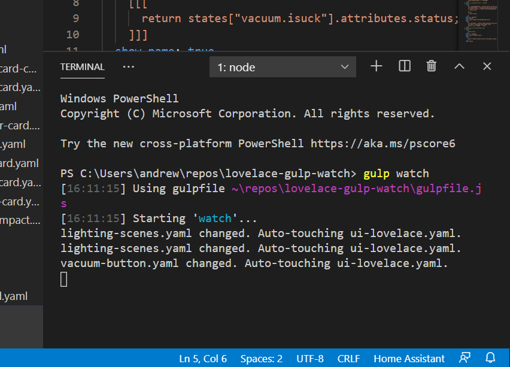

# lovelace-gulp-watch
Automatically update the modified date on ui-lovelace.yaml when another lovelace file changes. This is useful if you prefer splitting your lovelace config into multiple files with the use of !include, because HomeAssistant will not refresh the UI unless ui-lovelace.yaml is modified.

This tool runs in the background and watches for changes in a configurable location(s), and touches ui-lovelace.yaml when triggered.



## Installation

1. Install [node.js](https://nodejs.org/en/)

2. Install gulp globally

    ```
    > npm install -g gulp
    ```

3. Clone the repo if you haven't already

    ```
    > git clone https://github.com/akmolina28/lovelace-gulp-watch.git
    ```
    
4. Install node packages (in the clone directory)

    ```
    > npm install
    ```
    
5. Edit config.json to set up the watch path and the ui-lovelace.yaml path. Alternatively, you can set up a symlink named config, and then you don't have to change the config file.

    Here is how I set up the symlink in windows, with HA available using Samba share:

    ```
    > mklink /D config \\192.168.1.53\config
    ```
    
6. Start the process

    ```
    gulp watch
    ```
